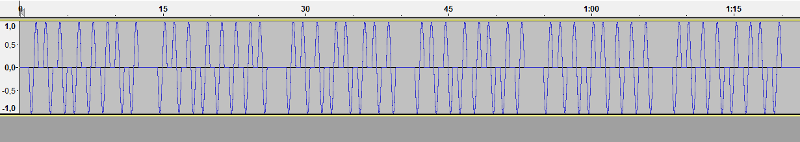
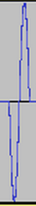

# Backdoor CTF 2013: Forensics 300

**Category:** Forensics
**Points:** 300
**Solves:** 
**Description:** 

> H4x0r has now learnt that simple text authentications are not the in thing today. Also since voice authentication is all the rage nowadays thanx to siri, he decided to get one for his castle. But he messed it big time and now has a audio file which he himself can't seem to decipher. So now he needs your help to get into his own castle. 
> 
> You can find the file [here](siri_audio.zip).
> 
> Find the hidden passphrase, the flag is the MD5 of the passphrase.
>
> HINT: It is a audioWAVE. Sometimes you might have to see things instead of hearing them.

## Write-up

This writeup is based on [h34dump](http://h34dump.com/2013/03/backdoorctf-2013-forensics-300/)'s writeup.

We are given an audiowave file and open it with `audacity` and see this waveform:



We see that there are six 16 spikes/ 8 sin waves and imply that we can decode the waves:



as `0`

and


as `1`.

This results in the bitstream `011000100110000101101011011001000110111101110010`, which can be translated into ASCII characters using a simple perl command:


```bash
$ echo 011000100110000101101011011001000110111101110010 | perl -lpe '$_=pack"B*",$_'
bakdor
$ echo -n bakdor
e1b64df17443b51e3007fd3d5370dca1
```

The flag is `e1b64df17443b51e3007fd3d5370dca1`.

## Other write-ups and resources

* <http://h34dump.com/2013/03/backdoorctf-2013-forensics-300/>