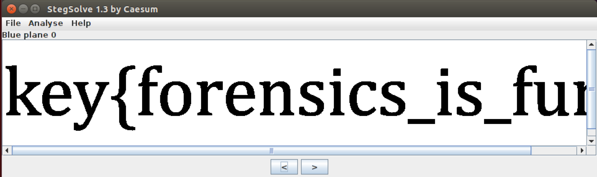

# CSAW Quals CTF 2015: Black & White

**Category:** Misc
**Points:** 100
**Solves:** 818
**Description:** 

> [chal.png](chal.png)

## Write-up

We are given a PNG that seems to be just white.

However, using a steganography tool like [stegsolve](https://aur.archlinux.org/packages/stegsolve/), we see the flag in the blue, red or green 0 pane:

The flag is `key{forensics_is_fun}`.

## Other write-ups and resources

* none yet