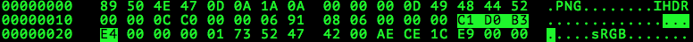
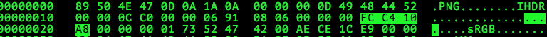
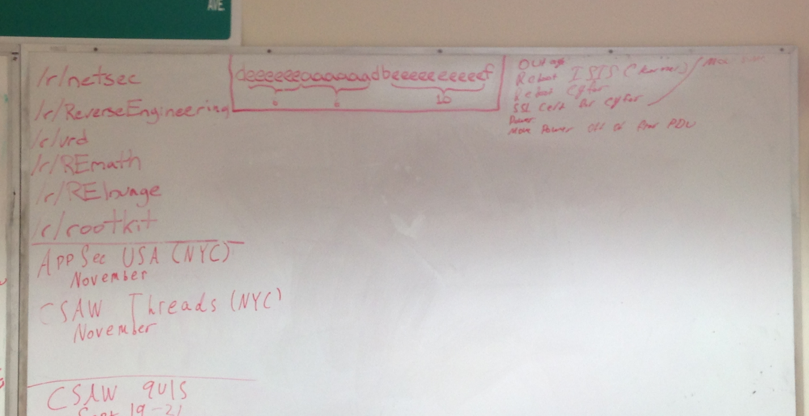
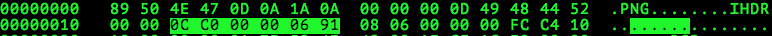
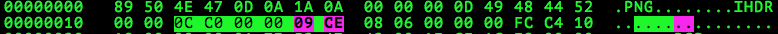
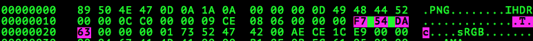
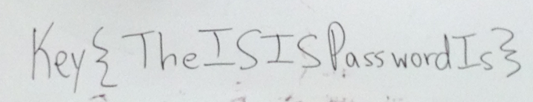

# CSAW Quals CTF 2015: deeeeeeaaaaaadbeeeeeeeeeef

**Category:** Misc
**Points:** 200
**Solves:** 224
**Description:** 

> [IMG_0707.png](IMG_0707.png)

## Write-up

We are given a corrupt PNG file:

```bash
$ file IMG_0707.png
IMG_0707.png: PNG image data, 3264 x 1681, 8-bit/color RGBA, non-interlaced
$ pngcheck IMG_0707.png
IMG_0707.png  CRC error in chunk IHDR (computed fcc410a8, expected c1d0b3e4)
ERROR: IMG_0707.png
```

Editing the CRC for the PNG in `hexedit` to the correct one, yields a valid PNG:





The picture looks like it has been resized, however, given the unusual aspect ratio of `3264:1681 ~= 1.94:1`.
We see using `exiftool` that the picture is made with an iPhone 5:

```bash
$ exiftool IMG_0707.png
ExifTool Version Number         : 9.76
[...]
Source                          : iPhone 5
Software                        : 6.1.4
[...]
Image Size                      : 3264x1681
```

The usual ratio of picture made by an [iPhone 5 camera](http://en.wikipedia.org/wiki/IPhone#Screen_and_input) is around `16:9` or `4:3`, so we apply the ratio to the picture using `hexedit` and fix the resulting new CRC sum:



```bash
$ pngcheck NEW.png
NEW.png  CRC error in chunk IHDR (computed f754da63, expected fcc410a8)
ERROR: NEW.png
```



The flag is `Key{TheISISPasswordIs}`.
## Other write-ups and resources

* none yet