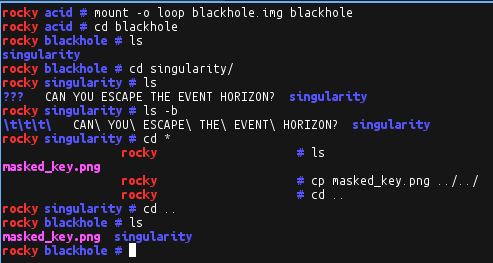
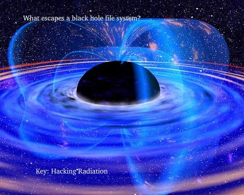

# PicoCTF 2013: Black Hole

**Category:** Forensic
**Points:** 115
**Description:**

> Near the galactic core, you find a beacon indicating that an ancient civilization hid one of their worlds [within a nearby black hole](https://2013.picoctf.com/problems/blackhole.img). Is this what passes for intergalactic humor, or is there actually something in there?
>
> The disk image can be found on the shell machines at `/problems/blackhole.img` and the contents of the image are available in `/problems/blackhole/`
>
> [Offline file](blackhole.img)

## Write-up

The first step is to obtain our masked_key.png file from blackhole.img.

After mounting the image, we see a directory that appears to be named “???”. However, using the hint we run “ls -b” and see that it is actually three tabs. We type cd * to enter the directory. (Hint: type echo * to see why this works.)

Once inside, we copy the file out.



At the end of the file, the string “EVENT HORIZON EVENT HORIZON” is repeated a few times… strange. And at the beginning of the file, we see traces of the event horizon as well:

```
\blackhole # hexdump -C masked_key.png | head -n 4
00000000  76 88 b1 a7 0d 1a 50 4c  49 46 00 48 1f 0d 0a 06  |v.....PLIF.H....|
00000010  48 4f 50 a7 5a 4f 4c 78  4d 50 45 4e 54 75 c1 31  |HOP.ZOLxMPENTu.1|
00000020  eb 5a 4f 4e 24 36 14 0c  1a 5c 40 47 5a 35 52 2b  |.ZON$6...\@GZ5R+|
00000030  c6 20 45 76 45 07 10 09  1b 2a d5 0e f3 97 50 bc  |. EvE....*....P.|
```

Very strange. We have reason to believe that this is a PNG file, so on a hunch I decided to XOR the first few bytes of the file with the PNG header.

```
Masked:
76 88 B1 A7 0D 1A 50 4C
PNG:
89 50 4E 47 0D 0A 1A 0A
XOR:
FF D8 FF E0 00 10 4A 46
```

This sequence exists in the file as the last 64 bytes.

```
000effc0  ff d8 ff e0 00 10 4a 46  49 46 00 45 56 45 4e 54  |......JFIF.EVENT|
000effd0  48 4f 52 49 5a 4f 4e 20  45 56 45 4e 54 48 4f 52  |HORIZON EVENTHOR|
000effe0  49 5a 4f 4e 20 45 56 45  4e 54 48 4f 52 49 5a 4f  |IZON EVENTHORIZO|
000efff0  4e 20 45 56 45 4e 54 48  4f 52 49 5a 4f 4e ff d9  |N EVENTHORIZON..|
```

We xor the file with the last 64 bytes:

```
Python 3.2.3 (default, Oct 24 2012, 19:34:37)
[GCC 4.5.4] on linux2
Type "help", "copyright", "credits" or "license" for more information.
>>> mask_in = open('masked_key.png','rb')
>>> key = bytearray(mask_in.read(983040-64))
>>> mask= bytearray(mask_in.read(64))
>>> for x in range(983040-64):
...     key[x] ^= mask[x%64]
...
>>> key_out = open('unmasked_key.png','wb')
>>> key_out.write(key)
982976
>>> key_out.close()
>>>
```

And out pops the key!



**Answer:** Hacking Radiation

## Other write-ups and resources

* none yet