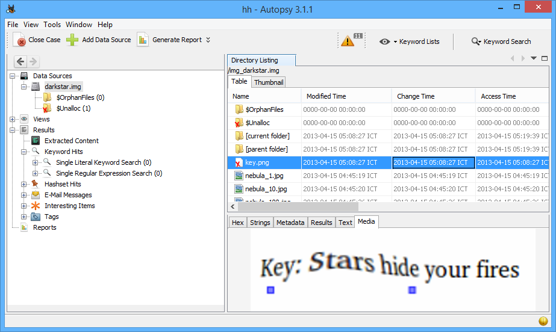

# PicoCTF 2013: Dark Star

**Category:** Forensic
**Points:** 110
**Description:**

> Sure are a lot of stars [out there](https://2013.picoctf.com/problems/darkstar.img)... but there's a lot of empty space for things to hide in, too.
>
> The disk image can be found on the shell machines at `/problems/dark_star.img` and the contents of the image are available in `/problems/dark_star/`
>
> [Offline file](darkstar.img)

## Write-up

Use tool [Autopsy](http://www.sleuthkit.org/autopsy/) > Create NewCase and import image file into it.



```
Key: Stars hide your fires
```

**Answer:** Stars hide your fires

## Other write-ups and resources

* none yet