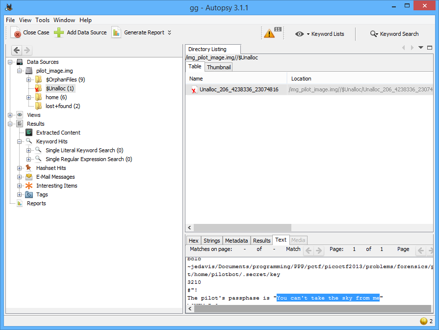

# PicoCTF 2013: Pilot Logic

**Category:** Forensic
**Points:** 75
**Description:**

> You've gotten a [partial dump of the disk](https://2013.picoctf.com/problems/pilot_image) from the hangar's machine, and you're pretty sure the pilot's password is *cleverly hidden* somewhere within it...
>
> The disk image can be found on the shell machines at `/problems/pilot_logic.img` and the contents of the image are available in `/problems/pilot_logic/`
>
> [offline file](pilot_image)

## Write-up

Use tool [Autopsy](http://www.sleuthkit.org/autopsy/) > Create NewCase and import image file into it.



```
The pilot's passphase is "You can't take the sky from me"
```

**Answer:** You can't take the sky from me

## Other write-ups and resources

* none yet