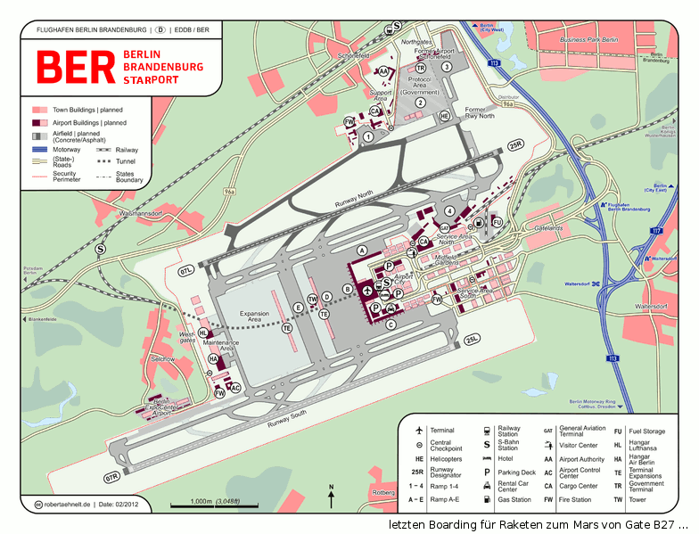
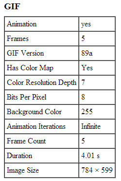
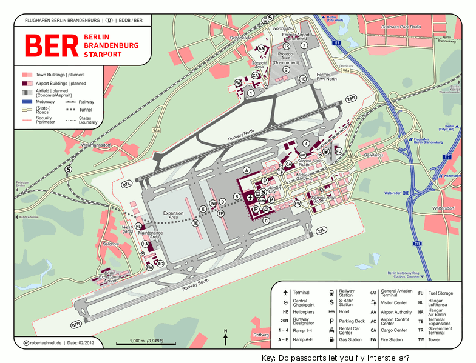

# PicoCTF 2013: Spaceport Map

**Category:** Trivival
**Points:** 55
**Description:**

> The map of the spaceport is hard to parse, but you're pretty sure there is some hidden information, somewhere...
>
> 

## Write-up

spaceportmap.gif is a animated image (will include some other frames).

Use [Jeffrey's Exif Viewer Tool](http://regex.info/exif.cgi) to extract all frames of it.



We can see Animated frame #4:



```
Key: Do passports let you fly interstellar?
```

**Answer:** Do passports let you fly interstellar

## Other write-ups and resources

* none yet