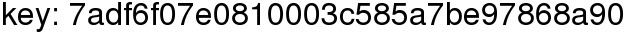

# PicoCTF 2013: Spamcarver

**Category:** Forensic
**Points:** 70
**Description:**

> While exploring an alien tomb, you find an ancient jpg of [an ancient can of SPAM](https://2013.picoctf.com/problems/spamcarver.jpg). It seems valueless, but the guardbots really want it back, so perhaps there's something more here than meets the eye. Maybe it's cursed, or hexed, if you will?
>
> [Offline file](spamcarver.jpg)

## Write-up

View file in hex:

```
00000000  FF D8 FF E0 00 10 4A 46 49 46 00 01 01 00 00 01  ÿØÿà..JFIF......
00000010  00 01 00 00 FF FE 00 3B 20 20 20 20 20 20 20 20  ....ÿþ.;        

[...]

0000CB80  AB D1 5D 7F DA 93 FE 5F C7 FE 00 1F FF D9 50 4B  «Ñ].Ú“þ_Çþ..ÿÙPK
0000CB90  03 04 14 00 02 00 08 00 F4 02 9F 41 D4 50 D9 9C  ........ô.ŸAÔPÙœ
0000CBA0  E3 2D 00 00 99 2E 00 00 08 00 1C 00 20 20 20 20  ã-..™.......    
0000CBB0  20 20 20 20 55 54 09 00 03 8B 4B E1 50 8C 4B E1      UT...‹KáPŒKá
0000CBC0  50 75 78 0B 00 01 04 E8 03 00 00 04 E8 03 00 00  Pux....è....è...
[...]
```

We will focus to file signature, `FF D8 FF E0 00 10 4A 46 49 46` is JPEG.
`50 4B 03 04` is PKZIP. Try extract, in Windows, seem to be error, file can't read.
Because file name has white space, we try extract in Linux.

```
$ unzip spamcarver.jpg

# rename file to display name
$ mv \ \ \ \ \ \ \ \ newfile.new 

$ file newfile.new
newfile.new; JPEG image data, JFIF standard 1.01
```

Open newfile.new with image viewer program to see flag.



**Answer:** 7adf6f07e0810003c585a7be97868a90

## Other write-ups and resources

* none yet